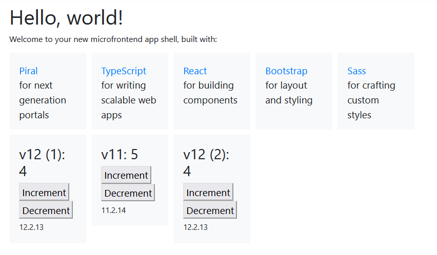
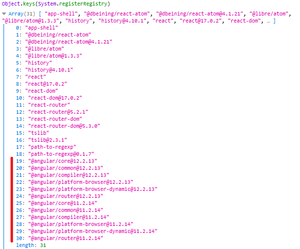

[](https://piral.io)

# [Piral Sample](https://piral.io) &middot; [](https://github.com/smapiot/piral/blob/main/LICENSE) [](https://gitter.im/piral-io/community)

> Sample project to illustrate implicitly sharing distinct Angular versions.

:zap: Let each pilet decide what version of Angular to use, but share that version implicitly if possible.

You can visit this demo at [angular-versions.samples.piral.cloud/](https://angular-versions.samples.piral.cloud/).

## Getting Started

Install the dependencies:

```sh
npx lerna bootstrap
```

Now run the application with all (3) pilets:

```sh
npm start
```

It contains three pilets, which are using two (2) versions of Angular. So one version has to be shared (implicitly) by two pilets (`first-pilet` and `third-pilet`), while Angular 11 is only used by one pilet (`second-pilet`).

On the dashboard it is shown as follows:



Note that running `npm start` (or `yarn start`) could lead to two pilets starting up fine, while the third refuses to build (due to weird errors). This is due to the monorepo aspects. We do **not** recommend using multiple versions of Angular in a monorepo. Angular (in particular `@ngtools`) gets easily confused here and chooses wrong things that lead to weird errors. If somebody has a good recipe to support this case, too, we are open for improvements.

In any case what you can do is just `touch` (e.g., via saving in VS Code) the file *packages/second-pilet/package.json*. This will trigger a partial recompilation which usually succeeds.

## More Information

Have a look at the registered dependencies:



As you can see, all `@angular/` packages are available in two different versions. This can also be observed in the network tab, where two files for each Angular dependency should be downloaded (instead of three).

## License

Piral and this sample code is released using the MIT license. For more information see the [license file](./LICENSE).
